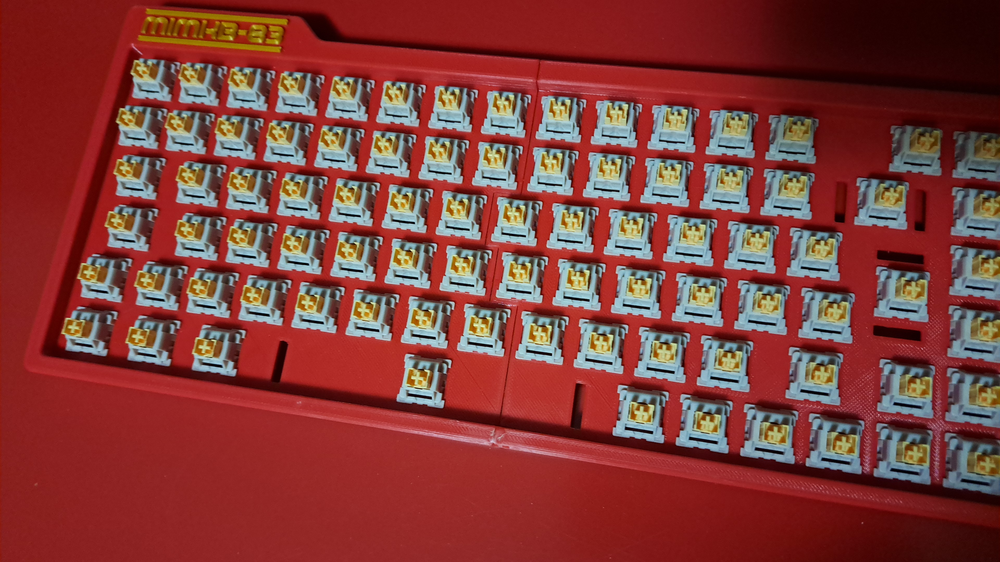

# MIMKB-83: Fully 3D printed DIY ISO 75% handwired mechanical keyboard powered by Raspberry Pi Pico

The keyboard is fully customizable, it supports layering, macros, dynamic sequences, and chords. The possibilities are endless. The project includes:

- Building instructions
- 3d model of the body of the keyboard
- 3d models of KeyV2 generated keycaps (default: ISO-ITA with Cherry profile)
- Wiring instructions
- Firmware source code for the Raspberry Pi Pico

## Features
The firmware is implemented to provide basic keyboard features and plus:

**Media keys**
- Fn + F1 = Mute audio
- Fn + F2 = Audio volume down
- Fn + F3 = Audio volume up

**Dynamic sequences (macros)**
- Fn + 1,2,...,0 = Select sequence slot
- Fn + F5 = Record sequence in the current slot
- Fn + F6 = Stop recording sequence in the current slot
- Fn + F7 = Play the sequence of the current slot

## Bill of materials and cost breakdown
You're supposed to have access to a 3D printer with some PLA spools. A PLA spool costs around 18-20€
For this build I've used:
- PLA plastic (18€)
- 90x Outemu Silent Peach linear switches (25€)
- Raspberry Pi Pico (7€)
- 200x 1N4148 Diodes (1,7€)
- 100x 8x2.5mm rubber feet (2€)
- Costar stabs (4,8€)
- Copper wire (2,7€)
- 12x M3x12mm screws (some cents)
- Some 22awg wire (some cents)
- Optional: Krytox GPL 205 lube because you love custom keyboards and lube switches and stabs, don't you?

**Total cost: 61,2€** and you will get a lot of remaining material available for other builds.

## Body parts
Navigate to the `model/body/STL` folder and print one copy of each file. You have 5 body parts in total: 2 pieces for the plate (`Top_left_iso` and `Top_right_iso`), 2 pieces for the housing (`Bottom_left` containing the microcontroller slot and `Bottom_right`), 
1 set of `Dowels` to keep all the pieces joined together and harden the structure. Import the files in your favorite slicer (Prusa slicer, Ultimaker Cura, etc...) and produce the gcode files. The prototype has been printed using the following settings:

- Printing material: PLA
- Standard quality (layer height 0.2mm, walls width 0.8mm with 2 perimetral lines, printing speed 50mm/s)
- Bed temperature: 60°C (it depends on the specific material)
- Extruder temperature: 200°C (it depends on the specific material)
- Infill: 20%
- 5mm of brim, around 13 lines just to avoid any warping effect
- no supports, they're not needed

Once all the parts are printed, glue and connect the two top half sectors and the two bottom half sectors, that's it.

## Keycaps
Navigate to the `model/body/keycaps/STL` folder and print everything. Prebuilt keycaps are for the 75% ISO-ITA layout, if you need advanced customization, please refer to the [advanced customizations](#advanced-customizations) section. You will find printable keycap groups with legends (filenames are pretty self-explanatory). You can use the same slicer configuration as the body parts, just consider placing the keycaps with the southern surface facing the bed plate, screenshot for reference:

## Wiring instructions
Here comes the ~~boring~~ fun part. First thing first, take the 3d printed plate and snap your favorite mechanical switches into it.

Turn over the plate, take the diodes and bend'em from the cathode side in this way:

Solder each anode to the leftmost pin of the switches, and the cathode to the next diode's cathode to create a row:

Snap the exceeding metal terminals and everything will look like this:

Repeat for all the rows and isolate them using electrical tape stripes. Then, solder the columns using some 0.5mm copper wire: connect the right pin of all the switches in the same column, like in the picture below:

Now, time to connect the switch matrix to the Raspberry Pi Pico board according to the following wiring diagram:

This is how it should look like:

And here's the PCB closeup:

Place the Raspberry Pi Pico in its slot, and fix it using a hot glue gun. The glue protects the cables and sticks the Raspberry pi pico in place. Close the keyboard and screw the plate and the housing together using 12mm M3 bolts, stick four 8x2.5mm rubber feet on the bottom surface of the keyboard snap the stabilizers in their slots, snap the keycaps on top of the switches and with the hardware you're pretty good to go.

## Firmware
4 simple steps:
1. Connect the keyboard to the PC.
2. Install [CircuitPython](https://learn.adafruit.com/welcome-to-circuitpython/installing-circuitpython) version 7.0 or above in the Raspberry Pi Pico.
3. Install [KMK](https://github.com/KMKfw/kmk_firmware/blob/master/docs/Getting_Started.md) in the board.
4. Replace the `code.py` file of the board with the one provided in the directory `firmware` of this project.

**Happy typing!**

## Advanced customizations
You can customize pretty much everything, the possibilities are endless. Install OpenSCAD on your PC, open the file `model/keycaps/KeyV2/keys.scad`. It's the layout definition of Mimkb-83. From there, you can edit legends and every possible feature such as height, stems, profiles, and so on. The most important files are two:

- `model/keycaps/KeyV2/keys.scad` to edit the layout and the keyboard profile (default: cherry/GMK)
- `model/keycaps/KeyV2/settings.scad` to edit stem type (default: rounded cherry), support type, sizes, and all the physical aspects of the keycaps.

For more info about keyboard profiles, have a look at [keycaps.info](https://keycaps.info).

You can also modify the firmware according to the [KMK documentation](http://kmkfw.io/)

## Credits
This project is based on and inspired by the work of some makers and developers out there. They provided their code to the world. A deserved shoutout to:

- [SICK-68 keyboard](https://www.thingiverse.com/thing:3478494) by FedorSosnin
- [The Raspberry Pi Pico](https://www.raspberrypi.com/products/raspberry-pi-pico/) open hardware board by the Raspberry Pi Foundation
- [KMKfw](http://kmkfw.io/) the pythonic keyboard firmware
- Bob rsheldii's [KeyV2](https://github.com/rsheldiii/KeyV2), a parametric mechanical keycap library